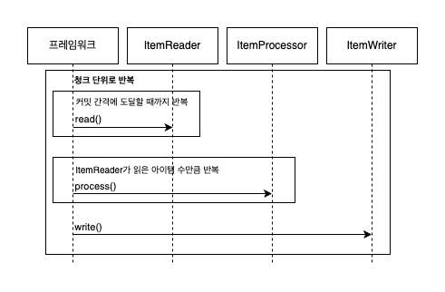
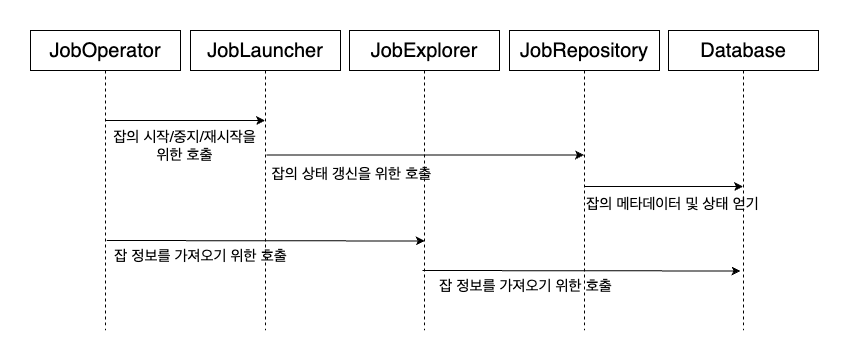

# spring-batch-practice

## Job

### JobLauncher

- 잡을 실행하는 역할
- 잡의 재실행 가능 여부 검증
- 잡의 실행 방법
- 파라미터 유효성 검증

> `@EnableBatchProcessing`  
> 스프링 부트 3 버전 이상부터는 더이상 필요하지 않음  
> 추가하게 되면 기존의 자동 구성이 사라지게 됨

#### JobRunner

- 잡 이름과 여러 파라미터를 받아 잡을 실행시키는 역할
- 프레임워크가 제공하는 표준 모듈이 아님
- 실제 진입점은 잡 러너가 아닌 `JobLanuncher` 의 구현체
- 두 개의 잡 러너가 존재
  - `CommandLineJobRunner` (스프링 부트에서는 `JobJauncherCommandLineRunner` 도 제공)
  - `JobRegistryBackgroundJobRunner`

### JobRepository

- 청크의 처리가 스텝 내에서 완료되면 JobRepository 내부에 있는 JobExecution 또는 StepExecution 에 상태를 갱신
- 청크를 처리할 때마다 커밋 수, 시작 및 종료 시간, 기타 정보가 있는 StepExecution 의 스텝 상태 업데이트

### JobInstance

- 스프링 배치 잡의 논리적인 실행, 잡의 이름과 잡의 논리적인 실행을 위해 제공되는 고유한 식별 파라미터 모음
- 잡이 실행될 때마다 새로운 JobInstance 생성
- 실패한 잡을 재식작하면 JobInstance 은 생성되지 않음

### JobExecution

- 스프링 배치 잡의 실제 실행
- 잡을 구동할 때마다 새로운 JobExecution 생성
- 잡이 실패한 이후 다시 실행해도 새로운 JobExecution 생성

### StepExecution

- 스텝의 실제 실행
- JobExecution 은 StepExecution 여러 개와 연관

### 구성 요소

- `JobRepository`
  - 실행 중인 잡의 상태를 기록하는 데 사용
- `JobLauncher`
  - 잡을 구동하는 데 사용
- `JobExplorer`
  - JobRepository 을 사용해 읽기 전용 작업을 수행하는데 사용
- `JobRegistry`
  - 특정 런처 구현체를 사용할 때 잡을 찾는 용도
- `PlatformTransactionManager`
  - 잡 진행 과정에서 트랜잭션을 다루는데 사용
- `JobBuilderFactory`
  - 잡을 생성하는 빌더 (`JobBuilder` 로 대체)
- `StepBuilderFactory`
  - 스텝을 생성하는 빌더 (`StepBuilder` 로 대체)

- `JobParameters`
  - `Map<String, JobParameter>` 객체의 래퍼
  - 타입 이름은 모두 **소문자**여야 함
  - `JobLauncherCommandLineRunner` 에 파라미터를 전달하기 위해서는 명령행으로 `key=value` 쌍을 전달하면 됨
    - ex) `java -jar demo.jar name=test`
    - 타입 변환 기능을 사용하고 싶으면 파라미터 이름 뒤에 **괄호를 쓰고 타입을 명시**하면 됨
      - ex) `java -jar demo.jar executionDate(date)=2020/01/01`
    - 잡 파라미터가 식별에 사용되지 않으려면 **접두사** `-` 추가
      - ex) `java -jar demo.jar executionDate(date)=2020/01/01 -name=foo`
    - 명령행 기능을 사용해 프로퍼티 구성하는 것과 다르므로 `--`, `-D` 접두사를 사용하면 안됨
    - intellij 에서 잡 파라미터를 전달하고 싶다면 `program arguments` 를 이용하면 됨

- `JobParametersValidator`
  - 잡 파라미터의 유효성 검증
  - 기본적으로 필수 파라미터가 전달됐는지 확인하는 `DefaultJobParametersValidator` 제공
  - 여러 개의 검증기를 사용하기 위해서는 `CompositeJobParameterValidator` 제공

- `JobParametersIncrementer`
  - 잡에서 사용할 파라미터를 고유하게 생성할 수 있도록 배치에서 제공하는 인터페이스
  - `RunIdIncrementer` 을 사용하면 `run.id` 인 `long` 타입 파라미터의 값을 증가
  - 실행 시마다 타임스탬프를 파라미터로 사용하고 싶다면 직접 구현 필요

- `JobExecutionListener`
  - 스프링 배치 생명주기의 여러 시점에 로직을 추가할 수 있도록 도와주는 인터페이스
  - 스텝, 리더, 라이터 등 컴포넌트에도 사용 가능
  - `JobExecutionListener` 을 구현하지 않아도 `@BeforeJob`, `@AfterJob` 애노테이션 사용 가능
    - `JobListenerFactoryBean.getListner` 를 통해 `JobExecutionListener` 를 구현한 빈을 등록
  - `beforeJob`, `afterJob` 두 메서드 제공
  - 사용 사례
    - 알림: 잡의 시작이나 종료를 알리는 메세지 큐 생성
    - 초기화: 잡 실행 전에 뭔가 준비해야 한다면 `beforeJob` 에서 수행
    - 정리: 잡의 성공/실패와 관계없이 실행 후에 뭔가 정리해야 한다면 `afterJob` 에서 수행

- `ExecutionContext`
  - 배치 잡의 세션 (간단하게 키-값 쌍을 보관하는 도구)
  - `JobExecution`, `StepExecution` 의 일부로 잡의 상태를 저장하는 곳
  - 잡을 다루는 과정에서 여러 개의 `ExecutionContext` 이 존재할 수 있음
  - 스텝 간에 데이터를 공유하고 싶다면 `ExecutionContextPromotionlistner` 사용

## 스텝

잡을 구성하는 독립된 작업의 단위  
태스크릿(tasklet)과 청크(chunk) 기반의 두 가지 스텝 유형 존재

- 태스크릿(tasklet)
    - `Tasklet.execute` 메서드가 `RepeatStatus.FINISHED` 를 반환할 때까지 트랜잭션 범위 내에서 반복 실행
    - 초기화, 저장 프로시저 실행, 알림 전송등에 많이 사용
    - 구현 방법에는 두 가지 유형이 존재
      - `Tasklet` 인터페이스의 `execute` 메서드 구현하여 `RepeatStatus` 반환하여 정의 가능
        - `RepeatStatus.CONTINUABLE`: 잡을 계속 수행하는 것이 아닌 해당 태스크릿을 다시 실행
        - `RepeatStatus.FINISHED`: 처리의 성공 여부에 관계 없이 처리를 완료하고 다음처리를 이어서 함
      - 다른 유형의 태스크릿
        - `CallableTaskletAdapter`: `java.util.concurrent.Callable<RepeatStatus>` 의 구현체를 구성할 수 있게 해주는 어댑터
        - `MethodInvokingTaskletAdapter`: 다른 클래스 내의 메서드를 잡 내의 태스크릿처럼 실행
        - `SystemCommandTasklet`: 시스템 명령을 비동기로 실행

- 청크(chunk)
  - 아이템 기반의 처리에 사용
  - 커밋 간격(commit interval)에 의해 정의
  - 3개의 주요 부분으로 구성될 수 있음
    - `ItemReader` : 데이터를 읽어옴
      - 첫번째 루프로 청크 단위로 처리할 모든 레코드를 반복적으로 메모리로 가져옴
    - `ItemProcessor` : 데이터를 가공(선택)
      - 메모리로 읽어온 아이템들을 반복적으로 수행
    - `ItemWriter` : 데이터를 저장
      - 물리적 쓰기를 일괄적으로 처리
  - `CompletionPolicy` 를 통해 청크가 완료되는 시점 정의
    - `SimpleCompletionPolicy`: 처리된 아이템 개수를 세고 구성해둔 임계 값에 도달하면 완료 표시
    - `TimeoutTerminationPolicy`: 처리 시간이 해당 시간을 넘길 때 완료된 것으로 간주
    - `CompositeCompletionPolicy`: 여러 정책을 함께 구성 가능
  

### 스텝 리스너

스텝 리스너도 잡 리스너와 동일하게 시작 및 종료 이벤트를 처리하지만 개별 스텝에서 이뤄짐

- 두 인터페이스가 존재 (`StepListener` 는 마커 인터페이스) 
  - `StepExecutionListener`
  - `ChunkListener`
- 인터페이스 구현을 간단히 할 수 있도록 애노테이션도 제공
  - `@BeforeStep`, `@AfterStep` (`AfterStep`만 `ExitStaus` 반환)
  - `@BeforeChunk`, `@AfterChunk`

### 조건 로직

잡 내에서 `StepBuilder` 의 `next` 메서드 뿐만 아닌 전이(translation) 구성으로 다른 순서로 실행   

- `on` 메서드는 스프링 배치가 스텝의 `ExitStatus` 를 확인하여 다음 스텝을 결정
  - `*` 은 0개 이상의 문자를 일치 (ex. `C*` 는 `C`, `COMPLITE`, `CORRECT` 일치)
  - `?` 는 1개의 문자를 일치 (ex. `?AT` 는 `CAT`, `KAT` 일치)
- `JobExecutionDecider`: 특정 스텝을 실행 여부 판단

### 잡 종료하기

잡을 종료할 때 세 가지 상태로 종료 가능

- `Completed`
  - 스프링 배치 처리가 성공적으로 종료
  - 동일한 파라미터로 재실행 불가
  - 스텝에서 반환된 상태와 무관하게 `Completed` 상태로 잡을 종료하려면 `end` 메서드 사용
- `Failed`
  - 잡이 성공적으로 완료되지 않음
  - 동일한 파라미터로 재실행 가능
  - `Failed` 상태로 잡을 종료하려면 `fail` 메서드 사용
- `Stoped`
  - 잡을 중단하고 중단된 위치에서 다시 시작 가능
  - 사람의 개입이나 검사, 처리가 필요한 상황에 유용

### 스텝 순서 외부화하기

스텝의 순서 외부화하는 세 가지 방법이 존재

- 스텝의 시퀀스를 독자적인 플로우로 생성 

- 플로우 스텝을 사용
   - 플로우를 잡 빌더로 전달하는 것과 비슷
   - 하나의 스텝처럼 기록하기 때문에 개별 스텝을 집계하지 않아도 플로우의 영향을 전체적으로 확인 가능  

- 잡내에서 다른 잡 호출
  - `JobParameterExtractor`: 상위 잡의 `JobParameters` 또는 `ExecutionContext` 에서 하위 잡으로 전달하는 클래스
    - `DefaultJobParameterExtractor` 는 `JobParameters`와 `ExecutionContext` 모두 확인함
  - 서브 잡은 자체적으로 `Jobinstance`, `ExecutionContext` 및 관련 데이터를 가짐
    - 다른 잡과 동일하게 `JobRepository` 내에서 식별
  - 잡 스텝으로 잡을 트리로 만들어 관리하면 제약이 생겨 문제를 일으킬 수 있음

## JobRepository

스프링 배치 내에서 `JobRepository` 는 두 가지 의미를 가짐
스프링 배치는 잡 내에서 사용할 수 있는 **인메모리**, **관계형 데이터베이스** 저장소를 제공

- `JobRepository` 인터페이스
- `JobRepository` 인터페이스를 구현한 데이터 저장소

### 저장소 유형

#### 관계형 데이터베이스 저장소

스프링 배치에서 기본적으로 사용되는 `JobRepository`  

- `BATCH_JOB_INSTANCE`
  - 시작점, 고유 정보가 포함된 잡 파라미터로 실행하면 단일 `JobInstance` 가 레코드로 등록
  - `JOB_INSTANCE_ID`: 기본키
  - `VERSION`: 낙관적인 락(optimistic locking) 에 사용되는 레코드 버전
  - `JOB_NAME`: 실행된 잡의 이름
  - `JOB_KEY`: 잡 이름과 잡 파라미터의 해시 값, `JobInstance`를 고유하게 식별하는 데 사용

- `BATCH_JOB_EXECUTION`
  - 배치 잡의 실제 실행 기록
  - `EXIT_CODE`: 잡 실행의 종료 코드
  - `EXIT_MESSAGE`: `EXIT_CODE`와 관련된 메시지나 스택 트레이스 

- `BATCH_JOB_EXECUTION_CONTEXT`
  - `JobExecution` 의 `ExecutionContext` 저장
  - `SHORT_CONTEXT`: 트림 처리된 `SERIALIZED_CONTEXT`
  - `SERIALIZED_CONTEXT`: `ExecutionContext` 를 직렬화한 값
    - 직렬화하는 방법에는 몇 가지 방법이 있지만 스프링 배치 4버전 Jackson2 를 기본적으로 사용 (직렬화 구성을 커스터마이징도 가능)

- `BATCH_JOB_EXECUTION_PAARAMS`
  - 실행될 때마다 사용된 잡 파라미터 저장
  - `PARAMETER_TYPE`: 파라미터 값의 타입
  - `PARAMETER_NAME` : 파라미터 이름
  - `IDENTIFYING`: 파라미터가 식별되는지 여부를 나타내는 플래그
  
- `BATCH_STEP_EXECUTION`
  - 스텝의 시작, 완료, 상태에 대한 메타데이터 저장 (읽기 횟수, 처리 횟수, 쓰기 횟수, 건너뛰기 횟수 등과 같은 모든 데이터 저장)
  - `COMMIT_COUNT`: 커밋된 트랜잭션 수
  - `READ_COUNT`: 읽은 아이템 수
  - `FILTER_COUNT`: 아이템 프로세서가 `null` 을 반환해 필터링된 아이템 수
  - `WRITE_COUNT`: 기록된 아이템 수
  - `READ_SKIP_COUNT`: `ItemReader` 내에서 예외가 던져졌을 때 건너뛴 아이템 수
  - `PROCESS_SKIP_COUNT`: `ItemProcessor` 내에서 예외가 던져졌을 때 건너뛴 아이템 수
  - `WRITE_SKIP_COUNT`: `ItemWriter` 내에서 예외가 던져졌을 때 건너뛴 아이템 수

- `BATCH_STEP_EXECUTION_CONTEXT`
  - 스텝 수준에서 컴포넌트의 상태를 저장하는 데 사용
  - `SHORT_CONTEXT`: 트림 처리된 `SERIALIZED_CONTEXT`
  - `SERIALIZED_CONTEXT`: `ExecutionContext` 를 직렬화한 값

#### 인메모리 저장소

잡을 개발하거나 단위 테스트를 수행할 때 외부 데이터베이스를 구성하는 작업에 문제 발생    
그래서 스프링 배치는 `Map` 객체를 저장소를 사용하는 `JobRepository` 구현체를 제공 

### 배치 인프라스트럭처 구성하기 

`BatchConfigurer` 인터페이스를 사용하면 `JobRepository` 를 비롯한 스프링 배치 인프라스트럭처 커스터마이징 가능 

#### `BatchConfigurer` 인터페이스

스프링 배치 인프라스트럭처 컴포넌트의 구성을 커스터마이징하는 데 사용되는 전략 인터페이스  
보통 모든 인터페이스를 구현하지 않고 `DefaultBatchConfigurer` 를 상속하여 적절한 메서드를 재정의  

#### `JobRepository` 커스터마이징

`JobRepository` 은 `JobRepositoryFactoryBean` 에서 생성

- `setClobType(int type)`
  - CLOB 칼럼에 사용할 타입 지정
- `setSerializer(ExecutionContextSerializer serializer)`
  - `ExecutionContext` 를 직렬화하고 역직렬화 하는 데 사용
- `setLobHandler(LobHandler lobHandler)`
  - `LOB` 를 특별하게 취급해야 하는 경우 사용
- `setMaxVarCharLength(int maxLength)`
  - 짧은 실행 컨텍스트, 종료 메시지의 길이를 자르는 데 사용
  - 스키마를 변경하지 않는다면 설정하면 안됨
- `setDataSource`
  - `JobRepository` 와 함께 사용할 데이터 소스 설정
- `setJdbcOperations`
  - `JdbcOperations` 인스턴스를 지정
- `setDatabaseType`
  - 데이터베이스 유형 설정
- `setTablePrefix`
  - 모든 테이블의 접두어 설정 (기본값: `BATCH_`)
- `setIncrementerFactory`
  - 대부분의 테이블의 기본 키를 증분하는 데 사용되는 증분기
- `setValidateTransactionState`
  - `JobExecution` 이 생성될 때 기존 트랜잭션이 있는지 여부
- `setIsolationLevelForCreate`
  - 트랜잭션 직렬화 수준을 지정 (기본값: `ISOLATION_SERIALIZABLE`)
- `setTransactionManager`
  - 복수 개의 데이터베이스를 사용하면 동기화할 수 있도록 2단계 커밋을 지원하는 트랜잭션 매니저를 지정

#### `TransactionManager` 커스터마이징

배치처리에 사용할 `TransactionManager`  
`TransactionManager` 가 생성되지 않은 경우에는 `DefaultBatchConfigurer` 가 기본적으로 `DataSourceTransactionManager` 를 생성

#### `JobExplorer` 커스터마이징

`JobExplorer` 는 배치 메타데이터를 읽기 전용으로 제공  
`JobExplorer` 는 `JobRepository` 가 다루는 데이터와 동일한 데이터를 읽기 전용으로만 보는 뷰

#### `JobLauncher` 커스터마이징

스프링 부트는 기본적으로 `SimpleJobLauncher` 를 사용  
대부분 커스터마이징할 필요는 없지만, 별도의 방식으로 구동하는 방법을 제공하려면 조정이 필요함

- `setJobRepository(JobRepository jobRepository)`
  - `JobRepository` 를 지정
- `setTaskExecutor(TaskExecutor taskExecutor)`
  - `JobLauncher` 에 사용할 `TaskExecutor` 지정 (기본값: `SyncTaskExecutor`)

#### 데이터베이스 구성하기

`initialize-schema` 옵션을 사용하면 스프링 배치가 데이터베이스를 구성하는 데 필요한 SQL을 실행할 수 있음

- `always`
  - 애플리케이션을 실행할 때마다 스크립트 실행
  - `drop` 문은 없고 오류가 발생되면 무시
  - 개발 환경에서 사용하기 쉬운 옵션
- `never`
  - 스크립트 실행하지 않음
- `embedded`
  - 내장 데이터베이스를 사용할 때 사용
  - 실행 시마다 데이터가 초기화된 데이터베이스 인스턴스를 사용한다는 가정으로 스크립트 실행

### 잡 메타데이터 사용하기

스프링 배치 메타데이터는에 접근하는 주된 방법은 `JobExplorer` 사용

#### `JobExplorer`

`JobExplorer` 는 `JobRepository` 에 있는 이력이나 최신 데이터에 접근하는 시작점  
`JobRepository` 는 잡 실행과 관련된 저장된 정보에 접근하지만, `JobExplorer` 는 데이터베이스에 직접 접근

- `Set<JobExecution> findRunningJobExecutions(String jobName)`
  - 종료 시간이 존재하지 않는 모든 `JobExecution` 을 반환
- `List<JobInstance> findJobInstancesByName(String name, int start, int count)`
  - 전달받은 이름을 가진 `JobInstance` 목록 반환
- `JobExecution getJobExecution(Long executionId)`
  - 전달받은 ID 를 가진 `JobExecution` 반환, 존재하지 않으면 `null` 반환
- `List<JobExecution> getJobExecutions(JobInstance jobInstance)`
  - 전달받은 `JobInstance` 관련된 모든 `JobExecution` 반환
- `JobInstance getJobInstance(Long instanceId)`
  - 전달받은 ID 를 가진 `JobInstance` 반환, 존재하지 않으면 `null` 반환
- `List<JobInstance> getJobInstances(String jobName, int start, int count)`
  - 전달받은 인덱스부터 개수만큼의 범위 내에 있는 `JobInstance` 목록 반환
- `int getJobInstanceCount(String jobName)`
  - 전달받은 이름을 가진 `JobInstance` 의 개수 반환
- `List<String> getJobNames()`
  - `JobRepository` 에 저장된 모든 잡 이름을 알파벳 순서대로 반환
- `StepExecution getStepExecution(Long jobExecutionId, Long stepExecutionId)`
  - 전달받은 `StepExecution`의 ID와 부모 `JobInstance`의 ID를 가진 `StepExecution` 반환

## 잡 실행하기

- 스프링 부트를 스프링 배치와 사용하면 `JobLauncherCommandLineRunner` 을 사용  
  - `JobLauncherCommandLineRunner` 는 `JobLauncher` 를 사용해서 잡을 실행
  - `JobLauncher` 에는 `run` 메서드 하나만 존재 (잡에 전달할 잡 파라미터를 인자로 전달)
  - 기본적으로 `SimpleJobLauncher` 는 동기식 `TaskExecutor` 를 사용해 동기식으로 실행

- REST 호출이나 특정 이벤트 등으로 배치 잡을 실행할 계획이라면 잡이 실행되지 않도록 설정 필요
  - `spring.batch.job.enabled` 프로퍼티를 `false` 로 설정
  - `JobParametersIncrementer` 을 사용할 때 변경 사항 적용은 `JobLauncher` 에서 처리
    - 파라미터가 잡에 전달되면 더 이상 변경할 수 없으므로 `JobParametersBuilder` 의 `getNextJobParameters` 메서드 사용

- 여러 잡이 정의되어 있는 상태에서 특정 잡만 실행하고 싶으면 실행할 잡 이름을 지정
  - `spring.batch.job.names=job1,job2`

- 쿼츠를 사용해서 잡을 주기적으로 실행
  - 쿼츠는 스케줄러, 잡, 트리거 세 가지 주요 컴포넌트를 가짐
  - 스케줄러는 `SchedulerFactor` 를 통해 가져올 수 있음
  - 트리거가 작동되고 잡을 실행하면 `JobDetails` 객체 생성 (`JobInstance` 와 유사)
  - 스케줄을 구성하려면 두 가지 작업 필요
    - 쿼츠 잡의 빈을 구성
    - 잡을 수행할 트리거가 존재하지 않아도 잡 정의를 삭제하지 않도록 `JobDetail` 생성

### 잡 중지하기

- 중지 트랜지션 사용하기
  - 중지 트랜지션을 사용해 중지하도록 구성 및 재시작 위치 지정
  - `stopAndRestart` 로 특정 `ExistStatus` 처리
  - 효과적이지만 잡의 트랜지션을 구성하고 스텝의 `ExistStatus` 정의 필요
    - [TransactionReader.kt](account-transaction-job%2Fsrc%2Fmain%2Fkotlin%2Fme%2Fdevyonghee%2Faccounttransactionjob%2FTransactionReader.kt) 의 `afterStep` 메서드

- StepExecution 을 사용해 중지하기
  - `afterStep` 메서드 대신 `beforeStep` 메서드를 사용해 `StepExecution` 가져오기
  - `StepExecution` 의 `setTerminateOnly` 메서드를 사용해 중지

### 오류 처리

- 잡 실패
  - 중지 방식과 다르게 스텝과 잡에 `ExistStatus.FAILED` 레이블이 지정
  - `ExistStatus.FAILED` 로 식별되면 스프링 배치는 해당 스텝을 처음부터 다시 시작하지 않음
  - 잡을 재시작하면 중단됐던 부분을 가져옴
    - 10개 청크 처리중 2번째 청크의 4번째 항목에서 에러가 발생되면 2번째 청크의 1~4번째 아이템은 롤백, 청크 1은 건너뜀

### 재시작 제어하기

- 재시작 방지하기
  - 실패하거나 중지될 때 다시 실행하면 안 되는 잡이 있다면 `JobBuilder` 의 `preventRestart` 호출

- 재시작 횟수 제한하기
  - 재시작 횟수를 제한하고 싶다면 `Step` 수준에서 제공하는 `startLimit` 으로 지정

### 완료된 스텝 재실행하기

- 스텝이 완료됐더라도 다시 실행하려면 `allowStartIfComplete` 를 `true` 로 설정