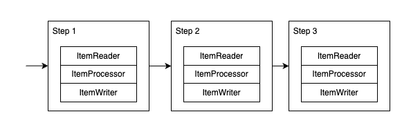
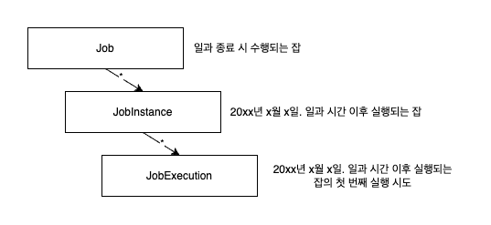
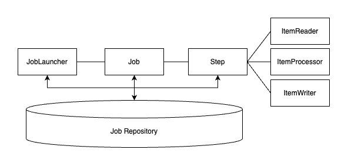

# spring-batch-practice

## Job

### JobLauncher

- 잡을 실행하는 역할
- 잡의 재실행 가능 여부 검증
- 잡의 실행 방법
- 파라미터 유효성 검증

> `@EnableBatchProcessing`  
> 스프링 부트 3 버전 이상부터는 더이상 필요하지 않음  
> 추가하게 되면 기존의 자동 구성이 사라지게 됨

#### JobRunner

- 잡 이름과 여러 파라미터를 받아 잡을 실행시키는 역할
- 프레임워크가 제공하는 표준 모듈이 아님
- 실제 진입점은 잡 러너가 아닌 `JobLanuncher` 의 구현체
- 두 개의 잡 러너가 존재
  - `CommandLineJobRunner` (스프링 부트에서는 `JobJauncherCommandLineRunner` 도 제공)
  - `JobRegistryBackgroundJobRunner`

### JobRepository

- 청크의 처리가 스텝 내에서 완료되면 JobRepository 내부에 있는 JobExecution 또는 StepExecution 에 상태를 갱신
- 청크를 처리할 때마다 커밋 수, 시작 및 종료 시간, 기타 정보가 있는 StepExecution 의 스텝 상태 업데이트

### JobInstance

- 스프링 배치 잡의 논리적인 실행, 잡의 이름과 잡의 논리적인 실행을 위해 제공되는 고유한 식별 파라미터 모음
- 잡이 실행될 때마다 새로운 JobInstance 생성
- 실패한 잡을 재식작하면 JobInstance 은 생성되지 않음

### JobExecution

- 스프링 배치 잡의 실제 실행
- 잡을 구동할 때마다 새로운 JobExecution 생성
- 잡이 실패한 이후 다시 실행해도 새로운 JobExecution 생성

### StepExecution

- 스텝의 실제 실행
- JobExecution 은 StepExecution 여러 개와 연관

### JobParameters

- `Map<String, JobParameter>` 객체의 래퍼
- 타입 이름은 모두 **소문자**여야 함

- `JobLauncherCommandLineRunner` 에 파라미터를 전달하기 위해서는 명령행으로 `key=value` 쌍을 전달하면 됨 
  - ex) `java -jar demo.jar name=test`
  - 타입 변환 기능을 사용하고 싶으면 파라미터 이름 뒤에 **괄호를 쓰고 타입을 명시**하면 됨
    - ex) `java -jar demo.jar executionDate(date)=2020/01/01`
  - 잡 파라미터가 식별에 사용되지 않으려면 **접두사** `-` 추가
    - ex) `java -jar demo.jar executionDate(date)=2020/01/01 -name=foo`
  - 명령행 기능을 사용해 프로퍼티 구성하는 것과 다르므로 `--`, `-D` 접두사를 사용하면 안됨
  - intellij 에서 잡 파라미터를 전달하고 싶다면 `program arguments` 를 이용하면 됨

## 스텝

잡을 구성하는 독립된 작업의 단위  
태스크릿(tasklet)과 청크(chunk) 기반의 두 가지 스텝 유형 존재

- 태스크릿(tasklet)
    - 스텝이 중지될 때까지 `execute` 메서드가 반복해서 수행
    - 초기화, 저장 프로시저 실행, 알림 전송등에 많이 사용
- 청크(chunk)
    - 아이템 기반의 처리에 사용
    - 3개의 주요 부분으로 구성될 수 있음
        - `ItemReader` : 데이터를 읽어옴
        - `ItemProcessor` : 데이터를 가공(선택)
        - `ItemWriter` : 데이터를 저장

- JobRepository: 실행 중인 잡의 상태를 기록하는 데 사용
- JobLauncher: 잡을 구동하는 데 사용
- JobExplorer: JobRepository 을 사용해 읽기 전용 작업을 수행하는데 사용
- JobRegistry: 특정 런처 구현체를 사용할 때 잡을 찾는 용도
- PlatformTransactionManager: 잡 진행 과정에서 트랜잭션을 다루는데 사용
- JobBuilderFactory: 잡을 생성하는 빌더 (`JobBuilder` 로 대체)
- StepBuilderFactory: 스텝을 생성하는 빌더 (`StepBuilder` 로 대체)
